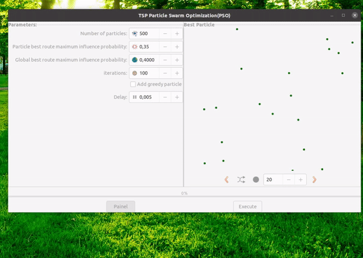

In a collaborative project with Professor Michal Bildo at Brno University in the Czech Republic, made possible by the UNIGOU program, I embarked on a journey to explore the world of Nature-Inspired Algorithms.

After a review of the literature and gaining insight into some of the principal nature-inspired algorithms, we decided to place a special emphasis on the Particle Swarm Optimization(PSO) technique. Our mission was to bring PSO to an educational graphical interface.

The softwar presented here was developed with the intention of offering students and teachers a chance to study, demonstrate, and visualize PSO; also allowing experimentation and personal adjustments. Here we bring a implementation of PSO solve the Traveling Salesperson Problem(TSP).

Details: [https://hitalocesar.github.io/posts/PSO/](https://hitalocesar.github.io/posts/PSO/)